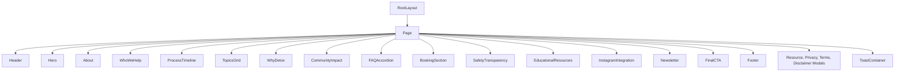

# Technical Architecture Documentation — DetoxWithBagga

## 1. System Overview

DetoxWithBagga is architected as a high-performance, single-page web application using Next.js App Router (React 19 / Next.js 15). The architecture emphasizes separation of concerns, data-driven section rendering, type-safe data modeling, and accessible design system components.

---

## 2. Component Hierarchy & Data Flow

### State Management
- **Topic Selection Flow**: User clicks a topic card in `TopicsGrid` -> parent `Home` state (`selectedBookingTopic`) updates -> automatically scrolls to `BookingSection` with topic pre-selected.
- **ScrollSpy Flow**: `Header` leverages `useScrollSpy` hook to observe section `offsetTop` and update active navigation highlight state dynamically without blocking main thread scroll events.
- **Theme State**: Managed via `useTheme` hook, toggling CSS variable root classes (`light-mode`) and persisting preference in `localStorage`.

---

## 3. Design System & Styling Methodology

- **Tailwind CSS v4 + CSS Custom Properties**: All colors, surfaces, borders, and glows are parameterized via CSS variables in `src/app/globals.css`.
- **Glassmorphism Panels**: Custom `.glass-panel` and `.glass-card` utilities implement `backdrop-filter: blur(16px)` with responsive borders and hover elevations.
- **Typography Scale**: Built on `Plus_Jakarta_Sans` with responsive fluid font scaling (`text-4xl sm:text-5xl lg:text-6xl`).

---

## 4. Accessibility & Motion System

- **WCAG 2.2 AA Compliance**:
  - `SkipLink` component at top of `body` allows screen reader/keyboard users to skip header navigation.
  - Interactive elements have explicit `:focus-visible` rings with `outline-offset: 3px`.
  - Motion keyframes (`animate-ambient`) automatically disable under `@media (prefers-reduced-motion: reduce)`.
